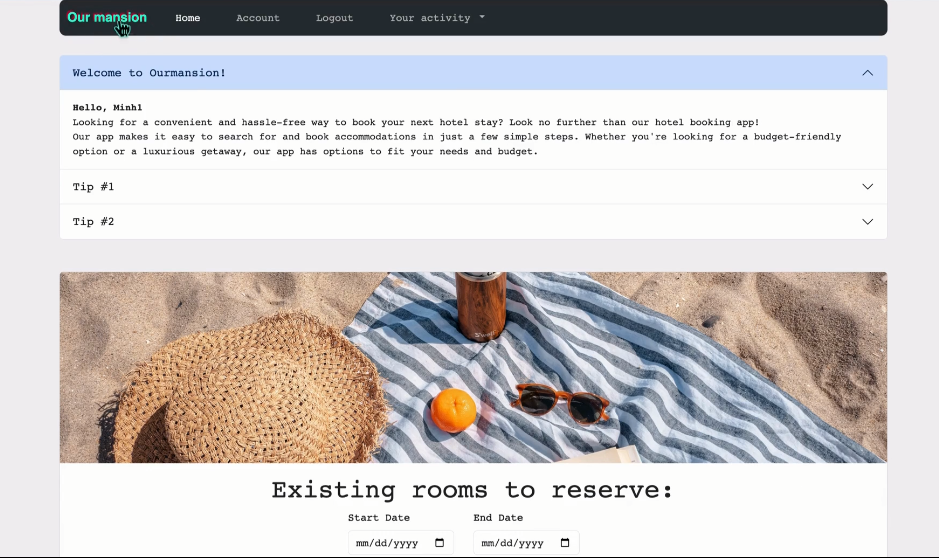

# Our-Mansion

## Hotel Booking Web Application | Final Project | CSI2532 - Base de Données | University of Ottawa

### Overview
Our-Mansion is a hotel booking web application developed as the final project for CSI2532 - Base de Données at the University of Ottawa. This application allows users to search for available hotel rooms, make reservations, and manage bookings using PHP and SQL-based database operations. 

### Features

- **Search for Hotel Rooms:** Users can browse available hotel rooms based on location, price, and amenities.
- **Book a Room:** Securely reserve a hotel room with real-time availability updates.
- **Manage Bookings:** View and modify reservations as needed.
- **Database Integration:** Efficient SQL queries ensure data consistency and accuracy.

### Technologies Used
- **Front-end:** PHP, HTML, CSS
- **Back-end:** PHP
- **Database:** SQL

### How to Run the Project
1. Clone this repository.
2. Set up a local PHP server (e.g., using XAMPP or MAMP).
3. Import the SQL database schema provided in the project.
4. Configure the database connection settings in the PHP files.
5. Run the application in your web browser.

### License
This project is for educational purposes and is licensed under [Insert License Type].